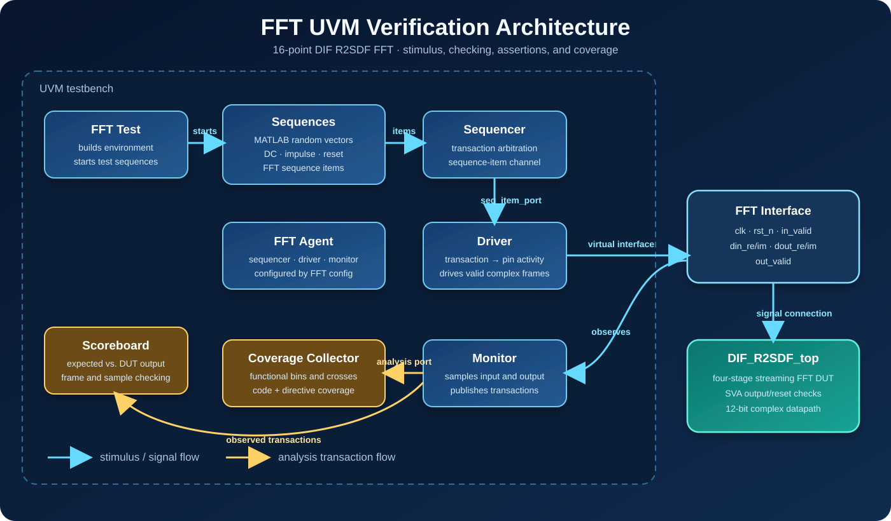

# UVM Verification

This directory contains the SystemVerilog/UVM verification environment for the FFT RTL, including assertions, constrained and file-driven stimulus, a reference-model scoreboard, functional coverage, and saved coverage reports.

## UVM architecture



The test starts the MATLAB-vector, directed, and reset sequences on the sequencer. The driver converts each sequence item into cycle-level activity through the virtual interface. The monitor observes the same interface and broadcasts reconstructed transactions to the scoreboard and functional coverage collector. Assertions bound to the DUT independently check reset and output-valid behavior.

## Environment structure

- `FFT_top.sv`: simulation top connecting the DUT and interface.
- `FFT_interface.sv`: clocked signal interface.
- `FFT_seq_item.sv`: transaction definition.
- `FFT_driver_pkg.sv` and `FFT_monitor_pkg.sv`: pin-level driving and observation.
- `FFT_agent_pkg.sv`, `FFT_env_pkg.sv`, and `FFT_config_pkg.sv`: UVM hierarchy and configuration.
- `FFT_scoreboard_pkg.sv`: output checking against expected FFT values.
- `FFT_coverage_pkg.sv`: functional covergroups and crosses.
- `FFT_main_seq_pkg.sv`: 1,000 MATLAB-generated random frames.
- `FFT_specific_seq_pkg.sv`: directed DC and impulse frames.
- `FFT_reset_seq_pkg.sv`: reset testing.
- `top.sv`: DUT top augmented with SystemVerilog assertions.
- `shared_pkg.sv`: shared constants and test control state.
- `src_files.list`: compilation order.

## Stimulus and checking

The main sequence reads `FFT_random_vectors.txt`, consuming 1,000 frames with 16 complex samples per frame. Directed sequences exercise DC and impulse responses, and a reset sequence checks reset behavior. The monitor forwards qualified samples to the scoreboard and coverage collector.

Assertions check reset behavior and output validity. The saved report records zero assertion failures.

## Running the regression

Use a UVM-capable ModelSim/Questa installation. Ensure `FFT_random_vectors.txt` is in the simulator working directory; the source copy is under `../MATLAB/`.

```tcl
do run.do
```

The script compiles with coverage enabled, runs `FFT_top`, saves `FFT_DB.ucdb`, applies documented exclusions, and writes `coverage_rpt_FFT.txt`.

## Checked-in results

- Functional covergroup coverage: **100.00%**.
- Directive coverage: **100.00%**.
- Output-validation assertion: **0 failures**.
- Reset assertion: **0 failures**.
- Filtered total coverage by instance: **100.00%**.
- `FFT_Dynamic_Code_and_Functional_Coverage.html` provides an interactive HTML view of the recorded coverage.

The exclusions in `run.do` primarily cover constant or structurally unreachable twiddle-ROM values, internal multiplier nodes, delay-line inputs, and specific unreachable branches. Review exclusions whenever the RTL changes.
